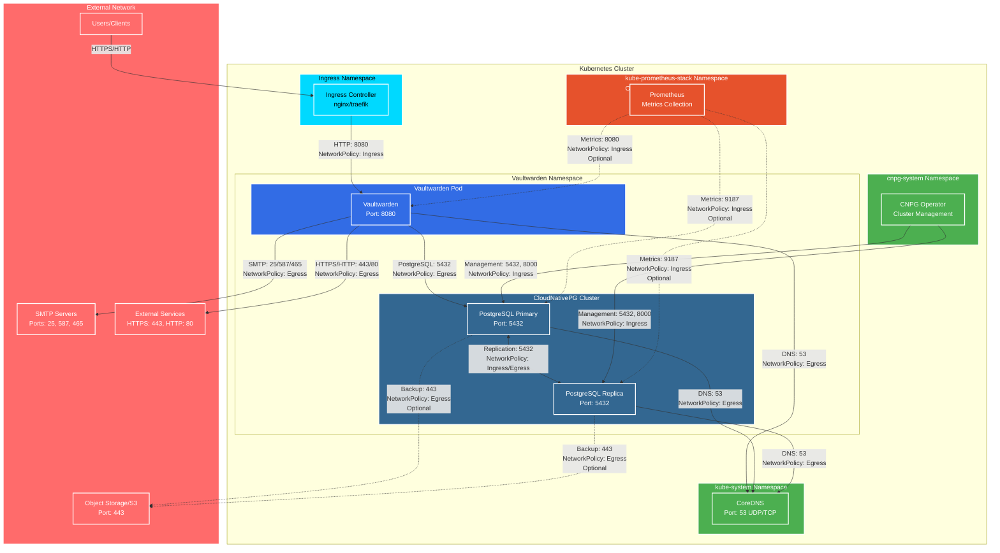

# Helm chart for Vaultwarden

[](https://img.shields.io/docker/v/vaultwarden/server/1.26.0)

[Vaultwarden](https://github.com/dani-garcia/vaultwarden), formerly known as **Bitwarden_RS**, is an "alternative implementation of the Bitwarden server API written in Rust and compatible with [upstream Bitwarden clients](https://bitwarden.com/download/), perfect for self-hosted deployment where running the official resource-heavy service might not be ideal."

## Architecture

The following diagram illustrates the Vaultwarden Helm chart architecture with network flows when NetworkPolicies are enabled:



### Network Flow Legend

- **Solid lines**: Required network flows
- **Dashed lines**: Optional network flows (configurable)
- **NetworkPolicy labels**: Indicate which NetworkPolicy rule controls the flow

### Key Components

1. **Vaultwarden Application**
   - Receives traffic from Ingress Controller on port 8080
   - Connects to PostgreSQL database on port 5432
   - Sends emails via SMTP servers
   - Accesses external services for push notifications and updates

2. **CloudNativePG Cluster**
   - Managed by CNPG operator
   - Supports high availability with primary/replica instances
   - Replication between instances on port 5432
   - Optional backup to Object Storage (S3-compatible)

3. **Network Policies**
   - Control ingress and egress traffic for both Vaultwarden and PostgreSQL
   - Disabled by default for compatibility
   - Enable with `networkPolicy.vaultwarden.enabled` and `networkPolicy.postgresql.enabled`

4. **Monitoring (Optional)**
   - Prometheus can scrape metrics from both Vaultwarden and PostgreSQL
   - Requires enabling monitoring in NetworkPolicy configuration

## TL;DR

```console
$ helm install my-release oci://registry-1.docker.io/captnbp/vaultwarden
```

## Prerequisites

- Kubernetes 1.30+
- Helm 3.2.0+
- PV provisioner support in the underlying infrastructure
- [cert-manager](docs/projects/csi-driver/#supported-volume-attributes)
- [CloudNativePG Operator](https://cloudnative-pg.io/documentation/current/) (if using PostgreSQL) 1.26+

## Migration from Bitnami PostgreSQL to CloudNativePG

This chart now uses [CloudNativePG](https://cloudnative-pg.io/) instead of Bitnami PostgreSQL for PostgreSQL database support. CloudNativePG is a Kubernetes operator that provides native PostgreSQL management capabilities.

### Key Changes

1. **Operator-based management**: CNPG uses a Kubernetes operator pattern for managing PostgreSQL clusters
2. **Native Kubernetes integration**: Better integration with Kubernetes APIs and resource management
3. **Enhanced features**: Support for high availability, backups, monitoring, and more

### Migration Steps

1. **Install CloudNativePG Operator**: Before deploying this chart, ensure the CNPG operator is installed in your cluster:

```bash
kubectl apply -f https://raw.githubusercontent.com/cloudnative-pg/cloudnative-pg/release-1.28/releases/cnpg-1.28.0.yaml
```

2. **Update your values**: The PostgreSQL configuration has changed. Update your `values.yaml`:

```yaml
postgresql:
  enabled: true
  instances: 1
  storage:
    size: 10Gi
  auth:
    username: vaultwarden
    database: vaultwarden
```

3. **Backup your data**: If migrating from an existing Bitnami PostgreSQL installation, ensure you have a backup of your database.

4. **Deploy**: Deploy the chart as usual. The CNPG operator will automatically create and manage the PostgreSQL cluster.

### Benefits of CNPG

- **Native Kubernetes integration**: Uses Kubernetes Custom Resource Definitions (CRDs)
- **Automated management**: Automatic failover, backups, and monitoring
- **Scalability**: Easy to scale PostgreSQL instances
- **High availability**: Built-in support for HA configurations
- **Backup and recovery**: Integrated backup solutions

> **Note**: If you were using external PostgreSQL, no changes are needed. The external database configuration remains the same.
=======

## Installing the Chart

To install the chart with the release name `my-release`:

```console
$ helm install my-release oci://registry-1.docker.io/captnbp/vaultwarden
```

These commands deploy Vaultwarden on the Kubernetes cluster in the default configuration. The [Parameters](#parameters) section lists the parameters that can be configured during installation.

> **Tip**: List all releases using `helm list`

## Uninstalling the Chart

To uninstall/delete the `my-release` release:

```console
$ helm delete my-release
```

The command removes all the Kubernetes components associated with the chart and deletes the release. Remove also the chart using `--purge` option:

```console
$ helm delete --purge my-release
```


## Parameters

### Global parameters

| Name                      | Description                                     | Value |
| ------------------------- | ----------------------------------------------- | ----- |
| `global.imageRegistry`    | Global Docker image registry                    | `""`  |
| `global.imagePullSecrets` | Global Docker registry secret names as an array | `[]`  |
| `global.storageClass`     | Global StorageClass for Persistent Volume(s)    | `""`  |

### Common parameters

| Name                     | Description                                                                             | Value           |
| ------------------------ | --------------------------------------------------------------------------------------- | --------------- |
| `kubeVersion`            | Force target Kubernetes version (using Helm capabilities if not set)                    | `""`            |
| `nameOverride`           | String to partially override common.names.fullname                                      | `""`            |
| `fullnameOverride`       | String to fully override common.names.fullname                                          | `""`            |
| `namespaceOverride`      | String to fully override common.names.namespace                                         | `""`            |
| `commonLabels`           | Labels to add to all deployed objects                                                   | `{}`            |
| `commonAnnotations`      | Annotations to add to all deployed objects                                              | `{}`            |
| `clusterDomain`          | Default Kubernetes cluster domain                                                       | `cluster.local` |
| `extraDeploy`            | Array of extra objects to deploy with the release                                       | `[]`            |
| `diagnosticMode.enabled` | Enable diagnostic mode (all probes will be disabled and the command will be overridden) | `false`         |
| `diagnosticMode.command` | Command to override all containers in the the statefulset                               | `["sleep"]`     |
| `diagnosticMode.args`    | Args to override all containers in the the statefulset                                  | `["infinity"]`  |

### Vaultwarden parameters

| Name                | Description                                                                                                 | Value                |
| ------------------- | ----------------------------------------------------------------------------------------------------------- | -------------------- |
| `image.registry`    | Vaultwarden image registry                                                                                  | `docker.io`          |
| `image.repository`  | Vaultwarden image repository                                                                                | `vaultwarden/server` |
| `image.tag`         | Vaultwarden image tag (immutable tags are recommended)                                                      | `1.35.2-alpine`      |
| `image.digest`      | Vaultwarden image digest in the way sha256:aa.... Please note this parameter, if set, will override the tag | `""`                 |
| `image.pullPolicy`  | Vaultwarden image pull policy                                                                               | `IfNotPresent`       |
| `image.pullSecrets` | Specify docker-registry secret names as an array                                                            | `[]`                 |
| `image.debug`       | Enable %%MAIN_CONTAINER%% image debug mode                                                                  | `false`              |
| `rocket.workers`    | Rocket number of workers                                                                                    | `10`                 |
| `webVaultEnabled`   | Enable Web Vault                                                                                            | `true`               |

### Security settings

| Name                 | Description                                                                     | Value         |
| -------------------- | ------------------------------------------------------------------------------- | ------------- |
| `adminToken`         | The admin token used for /admin                                                 | `""`          |
| `signupsAllowed`     | By default, anyone who can access your instance can register for a new account. | `true`        |
| `invitationsAllowed` | Even when registration is disabled, organization administrators or owners can   | `true`        |
| `signupDomains`      | List of domain names for users allowed to register                              | `example.com` |
| `signupsVerify`      | Whether to require account verification for newly-registered users.             | `true`        |
| `showPassHint`       | Whether a password hint should be shown in the page.                            | `false`       |
| `command`            | Override default container command (useful when using custom images)            | `[]`          |
| `args`               | Override default container args (useful when using custom images)               | `[]`          |
| `extraEnvVars`       | Extra environment variables to be set on vaultwarden container                  | `[]`          |
| `extraEnvVarsCM`     | Name of existing ConfigMap containing extra env vars                            | `""`          |
| `extraEnvVarsSecret` | Name of existing Secret containing extra env vars                               | `""`          |

### vaultwarden statefulset parameters

| Name                                    | Description                                                                                                              | Value               |
| --------------------------------------- | ------------------------------------------------------------------------------------------------------------------------ | ------------------- |
| `replicaCount`                          | Number of vaultwarden replicas to deploy                                                                                 | `1`                 |
| `containerPorts.http`                   | vaultwarden HTTP container port                                                                                          | `8080`              |
| `extraContainerPorts`                   | Optionally specify extra list of additional port-mappings for vaultwarden container                                      | `[]`                |
| `podSecurityContext.enabled`            | Enabled vaultwarden pods' Security Context                                                                               | `true`              |
| `podSecurityContext.fsGroup`            | Set vaultwarden pod's Security Context fsGroup                                                                           | `1000`              |
| `containerSecurityContext.enabled`      | Enabled vaultwarden containers' Security Context                                                                         | `true`              |
| `containerSecurityContext.runAsUser`    | Set vaultwarden container's Security Context runAsUser                                                                   | `1000`              |
| `containerSecurityContext.runAsNonRoot` | Set vaultwarden container's Security Context runAsNonRoot                                                                | `true`              |
| `resources.limits`                      | The resources limits for the vaultwarden containers                                                                      | `{}`                |
| `resources.requests`                    | The requested resources for the vaultwarden containers                                                                   | `{}`                |
| `livenessProbe.enabled`                 | Enable livenessProbe on vaultwarden containers                                                                           | `false`             |
| `livenessProbe.initialDelaySeconds`     | Initial delay seconds for livenessProbe                                                                                  | `300`               |
| `livenessProbe.periodSeconds`           | Period seconds for livenessProbe                                                                                         | `1`                 |
| `livenessProbe.timeoutSeconds`          | Timeout seconds for livenessProbe                                                                                        | `5`                 |
| `livenessProbe.failureThreshold`        | Failure threshold for livenessProbe                                                                                      | `3`                 |
| `livenessProbe.successThreshold`        | Success threshold for livenessProbe                                                                                      | `1`                 |
| `readinessProbe.enabled`                | Enable readinessProbe on vaultwarden containers                                                                          | `false`             |
| `readinessProbe.initialDelaySeconds`    | Initial delay seconds for readinessProbe                                                                                 | `30`                |
| `readinessProbe.periodSeconds`          | Period seconds for readinessProbe                                                                                        | `10`                |
| `readinessProbe.timeoutSeconds`         | Timeout seconds for readinessProbe                                                                                       | `1`                 |
| `readinessProbe.failureThreshold`       | Failure threshold for readinessProbe                                                                                     | `3`                 |
| `readinessProbe.successThreshold`       | Success threshold for readinessProbe                                                                                     | `1`                 |
| `startupProbe.enabled`                  | Enable startupProbe on vaultwarden containers                                                                            | `false`             |
| `startupProbe.initialDelaySeconds`      | Initial delay seconds for startupProbe                                                                                   | `30`                |
| `startupProbe.periodSeconds`            | Period seconds for startupProbe                                                                                          | `5`                 |
| `startupProbe.timeoutSeconds`           | Timeout seconds for startupProbe                                                                                         | `1`                 |
| `startupProbe.failureThreshold`         | Failure threshold for startupProbe                                                                                       | `60`                |
| `startupProbe.successThreshold`         | Success threshold for startupProbe                                                                                       | `1`                 |
| `customLivenessProbe`                   | Custom Liveness probes for vaultwarden                                                                                   | `{}`                |
| `customReadinessProbe`                  | Custom Rediness probes vaultwarden                                                                                       | `{}`                |
| `customStartupProbe`                    | Custom Startup probes for vaultwarden                                                                                    | `{}`                |
| `lifecycleHooks`                        | LifecycleHooks to set additional configuration at startup                                                                | `{}`                |
| `hostAliases`                           | Deployment pod host aliases                                                                                              | `[]`                |
| `podLabels`                             | Extra labels for vaultwarden pods                                                                                        | `{}`                |
| `podAnnotations`                        | Annotations for vaultwarden pods                                                                                         | `{}`                |
| `podAffinityPreset`                     | Pod affinity preset. Ignored if `affinity` is set. Allowed values: `soft` or `hard`                                      | `""`                |
| `podAntiAffinityPreset`                 | Pod anti-affinity preset. Ignored if `affinity` is set. Allowed values: `soft` or `hard`                                 | `soft`              |
| `nodeAffinityPreset.type`               | Node affinity preset type. Ignored if `affinity` is set. Allowed values: `soft` or `hard`                                | `""`                |
| `nodeAffinityPreset.key`                | Node label key to match. Ignored if `affinity` is set.                                                                   | `""`                |
| `nodeAffinityPreset.values`             | Node label values to match. Ignored if `affinity` is set.                                                                | `[]`                |
| `affinity`                              | Affinity for pod assignment                                                                                              | `{}`                |
| `nodeSelector`                          | Node labels for pod assignment                                                                                           | `{}`                |
| `tolerations`                           | Tolerations for pod assignment                                                                                           | `[]`                |
| `topologySpreadConstraints`             | Topology Spread Constraints for pod assignment spread across your cluster among failure-domains. Evaluated as a template | `[]`                |
| `podManagementPolicy`                   | Pod management policy for the vaultwarden statefulset                                                                    | `Parallel`          |
| `priorityClassName`                     | vaultwarden pods' Priority Class Name                                                                                    | `""`                |
| `schedulerName`                         | Use an alternate scheduler, e.g. "stork".                                                                                | `""`                |
| `terminationGracePeriodSeconds`         | Seconds vaultwarden pod needs to terminate gracefully                                                                    | `""`                |
| `updateStrategy.type`                   | vaultwarden statefulset strategy type                                                                                    | `RollingUpdate`     |
| `updateStrategy.rollingUpdate`          | vaultwarden statefulset rolling update configuration parameters                                                          | `{}`                |
| `extraVolumes`                          | Optionally specify extra list of additional volumes for vaultwarden pods                                                 | `[]`                |
| `extraVolumeMounts`                     | Optionally specify extra list of additional volumeMounts for vaultwarden container(s)                                    | `[]`                |
| `initContainers`                        | Add additional init containers to the vaultwarden pods                                                                   | `[]`                |
| `sidecars`                              | Add additional sidecar containers to the vaultwarden pods                                                                | `[]`                |
| `persistence.enabled`                   | Enable persistence                                                                                                       | `true`              |
| `persistence.storageClass`              | data Persistent Volume Storage Class                                                                                     | `""`                |
| `persistence.existingClaim`             | Provide an existing `PersistentVolumeClaim`                                                                              | `""`                |
| `persistence.accessModes`               | Persistent Volume access modes                                                                                           | `["ReadWriteOnce"]` |
| `persistence.size`                      | Size for the PV                                                                                                          | `10Gi`              |
| `persistence.annotations`               | Persistent Volume Claim annotations                                                                                      | `{}`                |
| `persistence.subPath`                   | The subdirectory of the volume to mount to, useful in dev environments and one PV for multiple services                  | `""`                |
| `persistence.selector`                  | Selector to match an existing Persistent Volume for WordPress data PVC                                                   | `{}`                |
| `persistence.dataSource`                | Custom PVC data source                                                                                                   | `{}`                |

### Exposure parameters

| Name                               | Description                                                                                                                      | Value                    |
| ---------------------------------- | -------------------------------------------------------------------------------------------------------------------------------- | ------------------------ |
| `service.type`                     | Kubernetes service type                                                                                                          | `ClusterIP`              |
| `service.ports.http`               | vaultwarden service HTTP port                                                                                                    | `8080`                   |
| `service.nodePorts`                | Specify the nodePort values for the LoadBalancer and NodePort service types.                                                     | `{}`                     |
| `service.sessionAffinity`          | Control where client requests go, to the same pod or round-robin                                                                 | `None`                   |
| `service.sessionAffinityConfig`    | Additional settings for the sessionAffinity                                                                                      | `{}`                     |
| `service.clusterIP`                | vaultwarden service clusterIP IP                                                                                                 | `""`                     |
| `service.loadBalancerIP`           | loadBalancerIP for the SuiteCRM Service (optional, cloud specific)                                                               | `""`                     |
| `service.loadBalancerSourceRanges` | Address that are allowed when service is LoadBalancer                                                                            | `[]`                     |
| `service.externalTrafficPolicy`    | Enable client source IP preservation                                                                                             | `Cluster`                |
| `service.annotations`              | Additional custom annotations for vaultwarden service                                                                            | `{}`                     |
| `service.extraPorts`               | Extra port to expose on vaultwarden service                                                                                      | `[]`                     |
| `service.extraHeadlessPorts`       | Extra ports to expose on vaultwarden headless service                                                                            | `[]`                     |
| `service.ipFamilyPolicy`           | Controller Service ipFamilyPolicy (optional, cloud specific)                                                                     | `PreferDualStack`        |
| `service.ipFamilies`               | Controller Service ipFamilies (optional, cloud specific)                                                                         | `[]`                     |
| `ingress.enabled`                  | Enable ingress record generation for vaultwarden                                                                                 | `true`                   |
| `ingress.pathType`                 | Ingress path type                                                                                                                | `ImplementationSpecific` |
| `ingress.apiVersion`               | Force Ingress API version (automatically detected if not set)                                                                    | `""`                     |
| `ingress.hostname`                 | Default host for the ingress record                                                                                              | `vaultwarden.local`      |
| `ingress.ingressClassName`         | IngressClass that will be be used to implement the Ingress (Kubernetes 1.18+)                                                    | `nginx`                  |
| `ingress.ingressControllerType`    | ingressControllerType that will be be used to implement the Ingress specific annotations (Ex. nginx or traefik)                  | `nginx`                  |
| `ingress.path`                     | Default path for the ingress record                                                                                              | `/`                      |
| `ingress.annotations`              | Additional annotations for the Ingress resource. To enable certificate autogeneration, place here your cert-manager annotations. | `{}`                     |
| `ingress.tls`                      | Enable TLS configuration for the host defined at `ingress.hostname` parameter                                                    | `false`                  |
| `ingress.selfSigned`               | Create a TLS secret for this ingress record using self-signed certificates generated by Helm                                     | `false`                  |
| `ingress.extraHosts`               | An array with additional hostname(s) to be covered with the ingress record                                                       | `[]`                     |
| `ingress.extraPaths`               | An array with additional arbitrary paths that may need to be added to the ingress under the main host                            | `[]`                     |
| `ingress.extraTls`                 | TLS configuration for additional hostname(s) to be covered with this ingress record                                              | `[]`                     |
| `ingress.secrets`                  | Custom TLS certificates as secrets                                                                                               | `[]`                     |
| `ingress.extraRules`               | Additional rules to be covered with this ingress record                                                                          | `[]`                     |

### RBAC parameter

| Name                                          | Description                                                  | Value   |
| --------------------------------------------- | ------------------------------------------------------------ | ------- |
| `serviceAccount.create`                       | Enable the creation of a ServiceAccount for vaultwarden pods | `true`  |
| `serviceAccount.name`                         | Name of the created ServiceAccount                           | `""`    |
| `serviceAccount.automountServiceAccountToken` | Auto-mount the service account token in the pod              | `false` |
| `serviceAccount.annotations`                  | Additional custom annotations for the ServiceAccount         | `{}`    |

### Database Configuration

| Name            | Description                                 | Value        |
| --------------- | ------------------------------------------- | ------------ |
| `database.type` | Database type, either default or postgresql | `postgresql` |

### Database parameters

| Name                                         | Description                                                             | Value         |
| -------------------------------------------- | ----------------------------------------------------------------------- | ------------- |
| `postgresql.enabled`                         | Enable CloudNativePG cluster deployment                                 | `true`        |
| `postgresql.instances`                       | Number of PostgreSQL instances (1 for single instance)                  | `1`           |
| `postgresql.parameters`                      | Postgresql parameters                                                   | `{}`          |
| `postgresql.storage.size`                    | Storage size for PostgreSQL data                                        | `10Gi`        |
| `postgresql.storage.storageClass`            | Storage class for PostgreSQL PVCs                                       | `""`          |
| `postgresql.storage.pvcTemplate`             | Additional PVC template configuration for PostgreSQL PVCs               | `{}`          |
| `postgresql.database.name`                   | Database name                                                           | `vaultwarden` |
| `postgresql.database.username`               | Database username                                                       | `vaultwarden` |
| `postgresql.database.existingSecret`         | Existing secret with database credentials                               | `""`          |
| `postgresql.resources`                       | Resource requests and limits for PostgreSQL pod                         | `{}`          |
| `postgresql.affinity`                        | Affinity configuration for PostgreSQL pod                               | `{}`          |
| `postgresql.tolerations`                     | Tolerations for PostgreSQL pod                                          | `{}`          |
| `postgresql.nodeSelector`                    | Node selector for PostgreSQL pod                                        | `{}`          |
| `postgresql.monitoring.enabled`              | Enable monitoring with PodMonitor                                       | `true`        |
| `postgresql.backup.enabled`                  | Enable Barman plugin WAL backup configuration                           | `false`       |
| `postgresql.backup.barmanObjectName`         | Barman ObjectStore name for backup                                      | `""`          |
| `postgresql.superuserSecret`                 | Secret containing superuser credentials for the cluster                 | `""`          |
| `postgresql.tls.enabled`                     | Enable TLS encryption for the cluster (requires cert-manager)           | `true`        |
| `externalDatabase.host`                      | Database host                                                           | `""`          |
| `externalDatabase.port`                      | Database port number                                                    | `5432`        |
| `externalDatabase.username`                  | Non-root username for vaultwarden                                       | `vaultwarden` |
| `externalDatabase.password`                  | Password for the non-root username for vaultwarden                      | `""`          |
| `externalDatabase.database`                  | vaultwarden database name                                               | `vaultwarden` |
| `externalDatabase.existingSecret`            | Name of an existing secret resource containing the database credentials | `""`          |
| `externalDatabase.existingSecretPasswordKey` | Name of an existing secret key containing the database credentials      | `""`          |

### SMTP Configuration

| Name                          | Description                           | Value      |
| ----------------------------- | ------------------------------------- | ---------- |
| `smtp.host`                   | SMTP host                             | `""`       |
| `smtp.security`               | SMTP Encryption method                | `starttls` |
| `smtp.port`                   | SMTP port                             | `587`      |
| `smtp.from`                   | SMTP sender email address             | `""`       |
| `smtp.username`               | Username for the SMTP authentication. | `""`       |
| `smtp.password`               | Password for the SMTP service.        | `""`       |
| `smtp.authMechanism`          | SMTP authentication mechanism         | `Login`    |
| `smtp.acceptInvalidHostnames` | Accept Invalid Hostnames              | `false`    |
| `smtp.acceptInvalidCerts`     | Accept Invalid Certificates           | `false`    |
| `smtp.debug`                  | SMTP debugging                        | `false`    |

### NetworkPolicy Configuration

| Name                                                                        | Description                                                                        | Value                  |
| --------------------------------------------------------------------------- | ---------------------------------------------------------------------------------- | ---------------------- |
| `networkPolicy.vaultwarden.enabled`                                         | Enable NetworkPolicy for vaultwarden                                               | `true`                 |
| `networkPolicy.vaultwarden.ingress.fromIngressController.enabled`           | Allow traffic from Ingress Controller                                              | `true`                 |
| `networkPolicy.vaultwarden.ingress.fromIngressController.namespaceSelector` | Namespace selector for Ingress Controller                                          | `{}`                   |
| `networkPolicy.vaultwarden.ingress.fromIngressController.podSelector`       | Pod selector for Ingress Controller                                                | `{}`                   |
| `networkPolicy.vaultwarden.ingress.fromMonitoring.enabled`                  | Allow traffic from monitoring namespace                                            | `false`                |
| `networkPolicy.vaultwarden.ingress.fromMonitoring.namespaceSelector`        | Namespace selector for monitoring                                                  | `{}`                   |
| `networkPolicy.vaultwarden.ingress.fromMonitoring.podSelector`              | Pod selector for monitoring                                                        | `{}`                   |
| `networkPolicy.vaultwarden.egress.toSMTP.enabled`                           | Allow traffic to SMTP servers                                                      | `true`                 |
| `networkPolicy.vaultwarden.egress.toSMTP.ports`                             | SMTP ports to allow                                                                | `[]`                   |
| `networkPolicy.vaultwarden.egress.toSMTP.cidrBlocks`                        | CIDR blocks to SMTP                                                                | `["0.0.0.0/0","::/0"]` |
| `networkPolicy.vaultwarden.egress.toInternet.enabled`                       | Allow traffic to Internet                                                          | `true`                 |
| `networkPolicy.vaultwarden.egress.toInternet.cidrBlocks`                    | CIDR blocks to Internet                                                            | `["0.0.0.0/0","::/0"]` |
| `networkPolicy.vaultwarden.egress.toInternet.ports`                         | Internet ports to allow                                                            | `[]`                   |
| `networkPolicy.vaultwarden.egress.extraEgress`                              | Add extra ingress rules to the NetworkPolicy (ignored if allowExternalEgress=true) | `[]`                   |
| `networkPolicy.postgresql.enabled`                                          | Enable NetworkPolicy for PostgreSQL CNPG                                           | `true`                 |
| `networkPolicy.postgresql.ingress.fromMonitoring.enabled`                   | Allow traffic from monitoring namespace                                            | `true`                 |
| `networkPolicy.postgresql.ingress.fromMonitoring.namespaceSelector`         | Namespace selector for monitoring                                                  | `{}`                   |
| `networkPolicy.postgresql.ingress.fromMonitoring.podSelector`               | Pod selector for monitoring                                                        | `{}`                   |
| `networkPolicy.postgresql.ingress.fromPostgresqlInstances.enabled`          | Allow traffic between PostgreSQL instances                                         | `true`                 |
| `networkPolicy.postgresql.ingress.fromCNPG.enabled`                         | Allow traffic from CNPG operator                                                   | `true`                 |
| `networkPolicy.postgresql.ingress.fromCNPG.namespaceSelector`               | Namespace selector for CNPG operator                                               | `{}`                   |
| `networkPolicy.postgresql.ingress.fromCNPG.podSelector`                     | Pod selector for CNPG operator                                                     | `{}`                   |
| `networkPolicy.postgresql.egress.toObjectStorage.enabled`                   | Allow traffic to Object Storage for backups                                        | `false`                |
| `networkPolicy.postgresql.egress.toObjectStorage.cidrBlocks`                | CIDR blocks for Object Storage                                                     | `["0.0.0.0/0","::/0"]` |

### Global TLS settings for internal CA

| Name                               | Description                                                                                | Value             |
| ---------------------------------- | ------------------------------------------------------------------------------------------ | ----------------- |
| `tls.enabled`                      | Enable internal TLS between Ingress controller and unifi                                   | `true`            |
| `tls.autoGenerated`                | Create cert-manager signed TLS certificates.                                               | `true`            |
| `tls.existingSecret`               | Existing secret containing the certificates for Unifi                                      | `""`              |
| `tls.subject.organizationalUnits`  | Subject's organizational units                                                             | `vaultwarden`     |
| `tls.subject.organizations`        | Subject's organization                                                                     | `vaultwarden`     |
| `tls.subject.countries`            | Subject's country                                                                          | `fr`              |
| `tls.issuerRef.existingIssuerName` | Existing name of the cert-manager http issuer. If provided, it won't create a default one. | `""`              |
| `tls.issuerRef.kind`               | Kind of the cert-manager issuer resource (defaults to "Issuer")                            | `Issuer`          |
| `tls.issuerRef.group`              | Group of the cert-manager issuer resource (defaults to "cert-manager.io")                  | `cert-manager.io` |

### Auxiliary image parameters

| Name                         | Description                                                                                               | Value                        |
| ---------------------------- | --------------------------------------------------------------------------------------------------------- | ---------------------------- |
| `auxiliaryImage.registry`    | Auxiliary image registry                                                                                  | `REGISTRY_NAME`              |
| `auxiliaryImage.repository`  | Auxiliary image repository                                                                                | `REPOSITORY_NAME/postgresql` |
| `auxiliaryImage.digest`      | Auxiliary image digest in the way sha256:aa.... Please note this parameter, if set, will override the tag | `""`                         |
| `auxiliaryImage.pullPolicy`  | Auxiliary image pull policy                                                                               | `IfNotPresent`               |
| `auxiliaryImage.pullSecrets` | Auxiliary image pull secrets                                                                              | `[]`                         |

## License

[MIT](./LICENSE).

## Author

This Helm chart was created and is being maintained by @captnbp.

### Credits

- The `vaultwarden` project can be found [here](https://github.com/dani-garcia/vaultwarden)
- Further information about `Bitwarden` and 8bit Solutions LLC can be found [here](https://bitwarden.com/)
